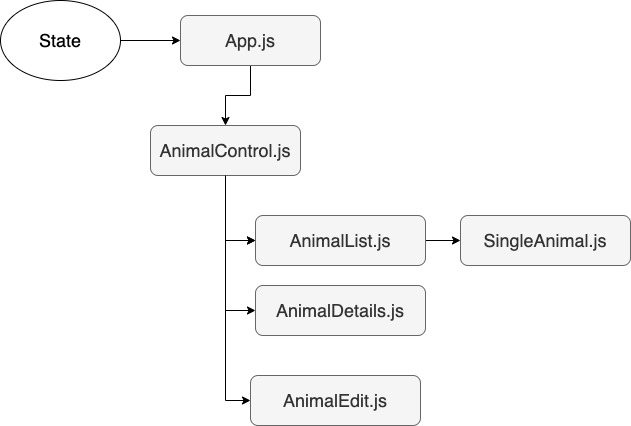

# Shelter WOW!
## A animal shelter frontend application built with React and Love.

#### By Dusty McCord, Steph Podolak, Patrick Kille, Geoff Snuggleupkins

## VIEW DEPLOYED SITE: 
coming soon...

## Page Preview


coming soon ...

## Components Hierarchy

 


## User Stories


|Component|Story|
|:---:|:---|
| Add Cat| Users should be able to add and update a cat listing with name, age, breed, gender |
| List Cats | Users should be able to list all cats in the shelter |
| Cat Details | Users should be able to view a specific cat's details by clicking on a cat in the cat list |
| Adopt a Cat | Users should be able to adopt a cat and that cat would be removed from the shelter list |
| Add Dog | Users should be able to add and update a dog listing with name, age, breed, gender |
| List Dogs | Users should be able to list all dogs in the shelter |
| Dog Details | Users should be able to view a specific dog's details by clicking on a dog in the dog list |
| Adopt a Dog | Users should be able to adopt a dog and that dog would be removed from the shelter list |

## Installation/Setup

Clone the project by typing this command into your terminal.
```sh
git clone https://github.com/dustatron/quality-survey-time.git
```

Navigate to the new project folder by typing:
```sh
cd quality-survey-time
```

Install all required packages with this command:
```sh
npm install
```

In the project directory, you can run: 

 ```sh
 npm start
```
Runs the app in the development mode.<br />
Open [http://localhost:3000](http://localhost:3000) to view it in the browser.

The page will reload if you make edits.<br />
You will also see any lint errors in the console.

 ```sh
 npm test
```
Launches the test runner in the interactive watch mode.<br />
See the section about [running tests](https://facebook.github.io/create-react-app/docs/running-tests) for more information.

 ```sh
  npm build
 ```

Builds the app for production to the `build` folder.<br />
It correctly bundles React in production mode and optimizes the build for the best performance.

The build is minified and the filenames include the hashes.<br />
Your app is ready to be deployed!

See the section about [deployment](https://facebook.github.io/create-react-app/docs/deployment) for more information.

 ```sh
  npm eject
 ```
**Note: this is a one-way operation. Once you `eject`, you can’t go back!**

If you aren’t satisfied with the build tool and configuration choices, you can `eject` at any time. This command will remove the single build dependency from your project.

Instead, it will copy all the configuration files and the transitive dependencies (webpack, Babel, ESLint, etc) right into your project so you have full control over them. All of the commands except `eject` will still work, but they will point to the copied scripts so you can tweak them. At this point you’re on your own.

You don’t have to ever use `eject`. The curated feature set is suitable for small and middle deployments, and you shouldn’t feel obligated to use this feature. However we understand that this tool wouldn’t be useful if you couldn’t customize it when you are ready for it.

## Support and Contact Details
_Have a bug or an issue with this application? [Open a new issue](https://github.com/dustatron/quality-survey-time/issues) here on GitHub._

## Technologies Used
* This project was bootstrapped with [Create React App](https://github.com/facebook/create-react-app).
* Components Diagram made with [Draw IO](https://draw.io/).

## License
[MIT](https://choosealicense.com/licenses/mit/)

Copyright (c) 2020 **_Dusty McCord, Steph Podolak_**